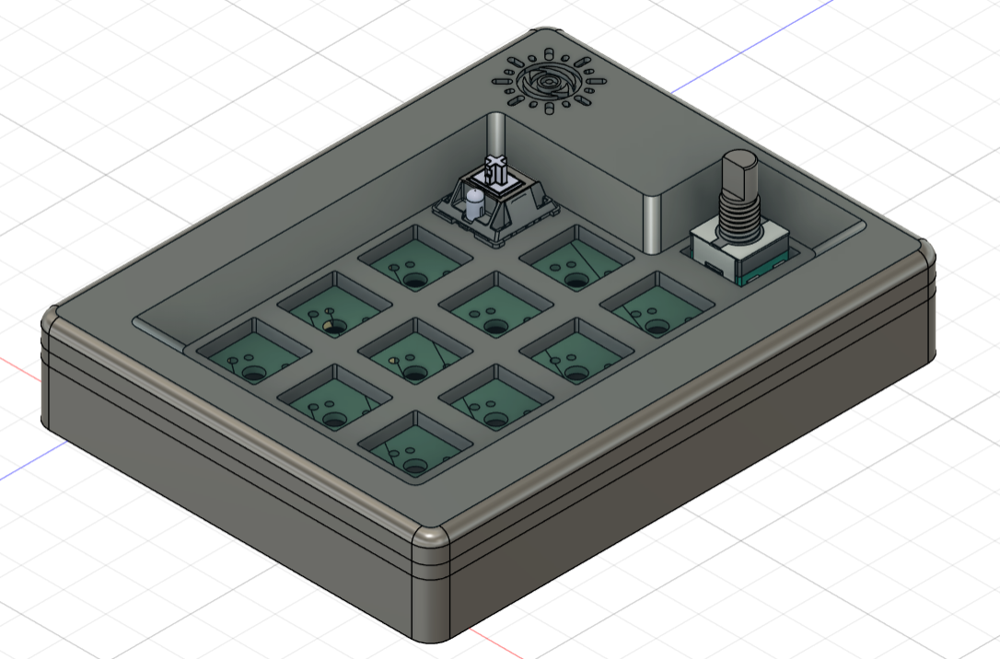
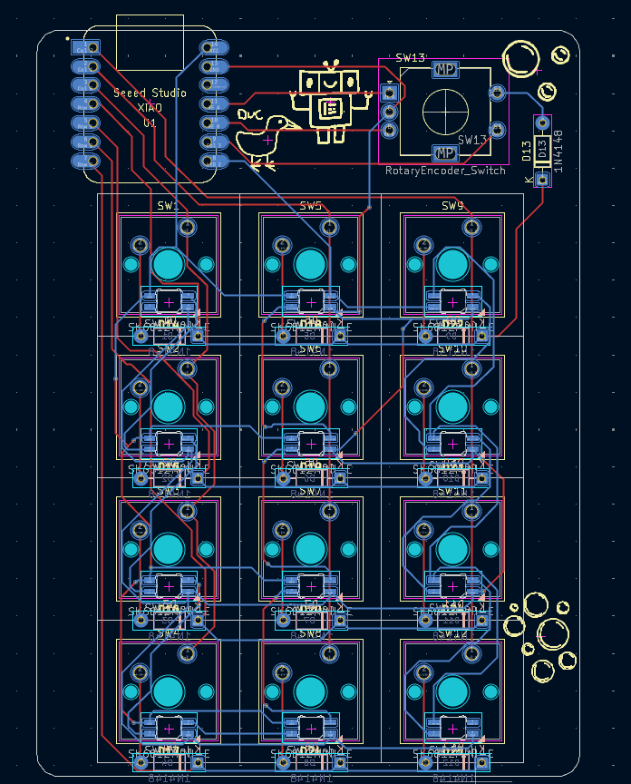
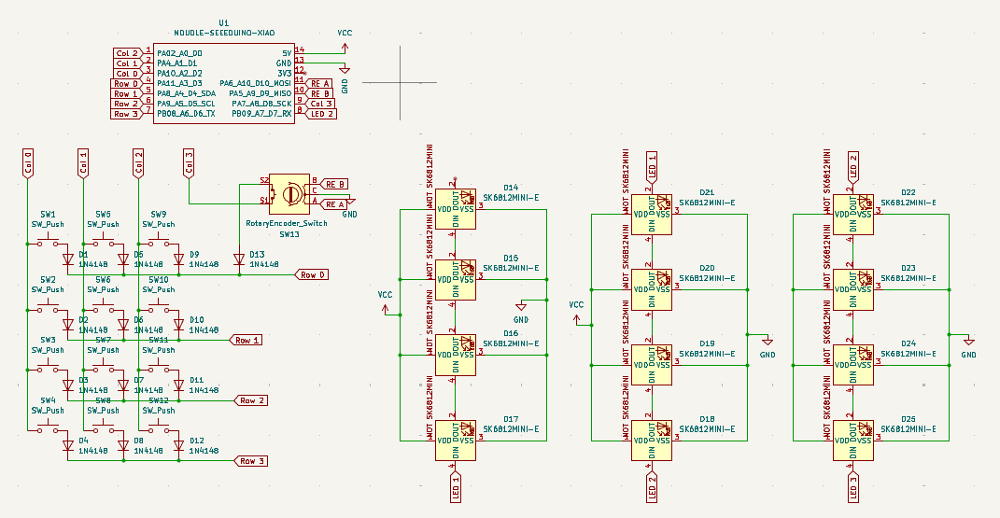
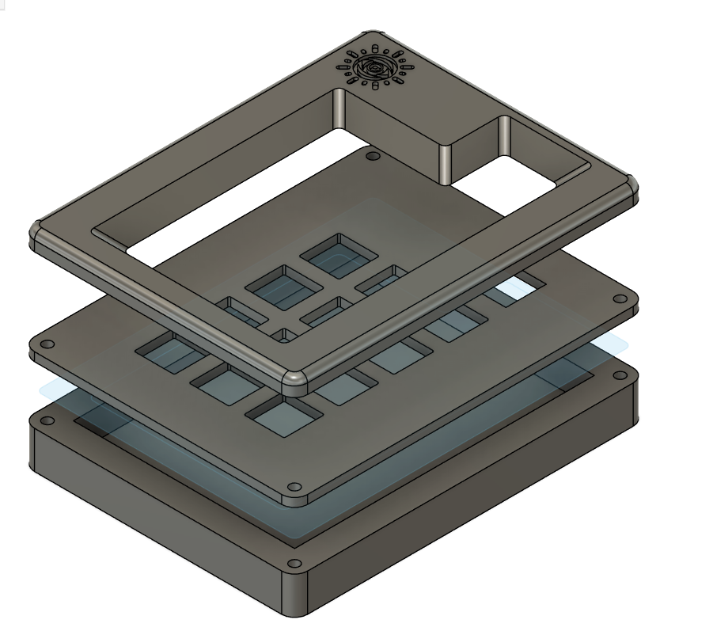

# hackpad
hackpad for hackclub blueprint
4x3 number pad with EC11 rotary encoder and RGB underglow

## PCB

PCB design

Schematic for the hackpad

## Case Design

## Bill Of Materials

* 1x unsoldered Seeed XIAO RP2040
* 13x through-hole 1N4148 Diodes
* 12 MX-Style switches
* 1x EC11 Rotary encoders
* 12x white blank DSA keycaps
* 12x SK6812 MINI-E LEDs
* 4x M3x16mm screws
* 4x M3x5mx4mm heatset inserts
